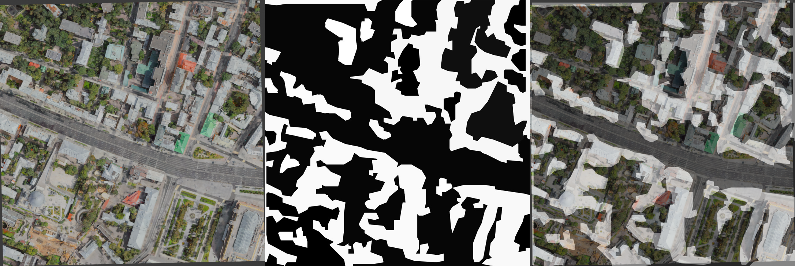

# Лидеры Цифровой Трансформации 2024
## Задание 6
Команда: МАИ8

Участники: 
- Кондаратцев Вадим Леонидович (капитан)
- Волков Матвей Андреевич
- Федоров Антон Сергеевич

# Инструкция
## Необходимые программы
- blender 4.1
- Anaconda 3

## Подготовка к запуску
1. Создать conda-окружение
    ```bash
    conda create -n hack_env python=3.10.12 --file requirements.txt
    ```
2. Установить blender 4.1 и добавить его в PATH

## Запуск
Демонстрационный пайплайн реализован в Notebook `pipeline.ipynb`.

Перед запуском сконфигурировать config и blender_config согласно комментариям к коду.

Результатом работы является geojson файл, содержащий пешеходные зоны.
Пайплайн прост в адаптации к более совершенным моделям и разметке других классов поверхностей.




## Просмотр результатов и экспорт 3D-сцены (Blender)
Одним из вариантов просмотра результатов является запуск заранее подготовленного Blender-скрипта
```bash
blender viewer.blend --python segmentation_visualizer.py -- blender_viewer_config.json
```

Итоговую 3D-сцену можно экспортировать в fbx для дальнейшей работы в Unreal Engine.

